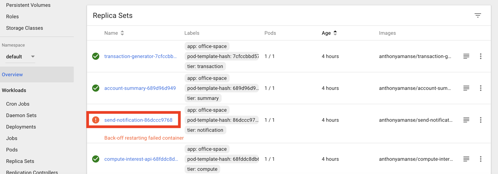
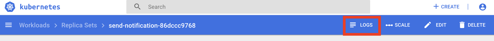

# Deploying Microservices

## Deploy Office Space sample application on Kubernetes

In this session, we demonstrate how a sample cloud native application can be deployed on top of Kubernetes. This application, Office Space, mimicks the fictitious app idea from Michael Bolton in the movie [Office Space](http://www.imdb.com/title/tt0151804/). The app takes advantage of a financial program that computes interest for transactions by diverting fractions of a cent that are usually rounded off into a seperate bank account.

The application includes a few services developed in different languages.
   * The key coponent of the application is a `Java 8/Spring Boot` microservice that computes the interest then takes the fraction of the pennies to a database. 
   * Another `Spring Boot microservice` is the notification service. It sends email when the account balance reach more than $50,000. It is triggered by the Spring Boot webserver that computes the interest. 
   * The frontend user interafce is a `Node.js` application that shows the current account balance accumulated by the Spring Boot app. 
   * The backend uses a `MySQL database` to store the account balance.
   * The transaction generator is a `Python` application that generates random transactions with accumulated interest. It's the last piece of your service mesh and used to simulate the transaction activities.

The instructions were adapted from the more comprehensive tutorial found here - https://github.com/IBM/spring-boot-microservices-on-kubernetes.


### Develop Microservices

During this session, we focus on deploying the microservices due to time constraint. Feel free to review the source code of the services, if you are interested.

Couple of microservices were developed in `Spring Boot` which is one of the popular Java microservices framework. Spring Cloud has a rich set of well integrated Java libraries to address runtime concerns as part of the Java application stack, and Kubernetes provides a rich featureset to run polyglot microservices. Together these technologies complement each other and make a great platform for Spring Boot applications.

Other microservices were developed in `Node.js` and `Python`. `MySQL Database` running in a separate container serves as persistent store. As a whole, the sample application delivers a native cloud architecture and follows 12 factors best practice.

The source code are in the following subfolders
   * containers/compute-interest-api
   * containers/send-notification
   * containers/account-summary
   * containers/transaction-generator


### Flow


1. The Transaction Generator service written in Python simulates transactions and pushes them to the Compute Interest microservice.
2. The Compute Interest microservice computes the interest and then moves the fraction of pennies to the MySQL database to be stored. The database can be running within a container in the same deployment or on a public cloud such as IBM Cloud.
3. The Compute Interest microservice then calls the notification service to notify the user when the total amount in the user’s account reaches $50,000.
4. The Notification service uses IBM Cloud Function to send an email message to the user.
5. The front end user interface in Node.js retrieves the account balance and display.

### Included Components

* [IBM Cloud Kubernetes Service](https://console.bluemix.net/docs/containers/container_index.html): IBM Bluemix Container Service manages highly available apps inside Docker containers and Kubernetes clusters on the IBM Cloud.
* [Compose for MySQL](https://console.ng.bluemix.net/catalog/services/compose-for-mysql): Probably the most popular open source relational database in the world.
* [IBM Cloud Functions](https://console.ng.bluemix.net/openwhisk): Execute code on demand in a highly scalable, serverless environment.

### Featured Technologies

* [Container Orchestration](https://www.ibm.com/cloud/container-service): Automating the deployment, scaling and management of containerized applications.
* [Databases](https://en.wikipedia.org/wiki/IBM_Information_Management_System#.22Full_Function.22_databases): Repository for storing and managing collections of data.
* [Serverless](https://www.ibm.com/cloud/functions): An event-action platform that allows you to execute code in response to an event.


### Steps

1. Clone the repo
2. Modify send-notification.yaml file for email notification
3. Deploy Database `MySQL` service
4. Deploy Microservice `compute-interest-api`
5. Deploy Microservice `send-notification`
6. Deploy Microservice `account-summary` - the Frontend User Interface
7. Deploy Microservice `transaction-generator` - the Transaction Generator service
8. Access Your Application

Each service in the application run in their containers. It has a Deployment and a Service. The deployment manages the pods started for each microservice. The Service creates a stable DNS entry for each microservice so they can reference their dependencies by name.


#### 1. Clone the repo

Clone this repository. In a terminal, run:

```
$ cd  ~

$ git clone https://github.com/lee-zhg/spring-boot-microservices-on-kubernetes

$ cd  spring-boot-microservices-on-kubernetes
```


#### 2. Modify send-notification.yaml file for email notification

> **Note: Additional Gmail security configurations may be required by Gmail to send/received email in this way.**

Optionally, if you like to send and receive email (gmail) notification, You will need to modify the **environment variables** in the `send-notification.yaml` file:

   ```yaml
    env:
    - name: GMAIL_SENDER_USER
       value: 'username@gmail.com' # change this to the gmail that will send the email
    - name: GMAIL_SENDER_PASSWORD
       value: 'password' # change this to the the password of the gmail above
    - name: EMAIL_RECEIVER
       value: 'sendTo@gmail.com' # change this to the email of the receiver
   ```


#### 3. Deploy `MySQL` Database

   * Deploy MySQL database

      ```bash
      $ kubectl create -f account-database.yaml

      service "account-database" created
      deployment "account-database" created
      ```

   * Create a secure storing credential of MySQL database

      Default credentials are already encoded in base64 in secrets.yaml.

      > Note: Encoding in base64 does not encrypt or hide your secrets. Do not put this in your Github.

      ```
      $ kubectl apply -f secrets.yaml

      secret "demo-credentials" created
      ```


#### 4. Deploy `compute-interest-api` service

Microservice `compute-interest-api` is written in Spring Boot. It's deployed to your cluster as one component of your service mesh.

   ```bash
   $ kubectl apply -f compute-interest-api.yaml

   service "compute-interest-api" created
   deployment "compute-interest-api" created
   ```


#### 5. Deploy `send-notification` service

Microservice `send-notification` is written in Spring Boot. It's deployed to your cluster as one component of your service mesh.

   ```bash
   $ kubectl apply -f send-notification.yaml

   service "send-notification" created
   deployment "send-notification" created
   ```


#### 6. Deploy `account-summary` service - the Frontend User Interface

The Frontend User Interface is a Node.js app serving static files (HTML, CSS, JavaScript) that shows the total account balance. It's another component of your service mesh.

   ```bash
   $ kubectl apply -f account-summary.yaml

   service "account-summary" created
   deployment "account-summary" created
   ```


#### 7. Deploy `transaction-generator` service - the Transaction Generator service

The transaction generator is a Python application that generates random transactions with accumulated interest. It's the last piece of your service mesh.

   ```bash
   $ kubectl apply -f transaction-generator.yaml

   service "transaction-generator" created
   deployment "transaction-generator" created
   ```

#### 8. Access Your Application

One way to access your application is through `Public IP` and `NodePort`.

* Locate public IP address

   ```bash
   $ ibmcloud ks workers <your k8s cluster>

   ID                                                 Public IP        Private IP      Machine Type   State    Status   
   kube-dal10-paac005a5fa6c44786b5dfb3ed8728548f-w1   169.47.241.213   10.177.155.13   free           normal   Ready  
   ```

   Take note of `Public IP`. `169.47.241.213` in this example.

* Locate NodePort

   ```bash
   $ kubectl get svc

   NAME                    CLUSTER-IP     EXTERNAL-IP   PORT(S)                                                                      AGE
   ......
   account-summary         10.10.10.74    <nodes>       80:30080/TCP                                                                 2d
   ......
   ```

   Take note of `PORT(S)` of the service `account-summary`. `30080` in the example.

* Access your application

   To test your application, go to `http://<Public IP>:<Port>` in your browser. For example, http://169.47.241.213:30080 in this example.

   


### Explore the Kubernetes Dashboard

Great, your application is deployed and working. 

There are quite a few microservices within your application. As your application is working, you would expect that all services are working. Are they? Let's find out.

After you have deployed all services, the Kubernetes Dashboard can provide an overview of your application and its components.

1. Login to IBM Cloud.

1. Locate and select your Kubernetes cluster.

   

1. Click the `Kubernetes Daskboard` button.

1. `Kubernetes Dashboard` window opens.

   

1. The charts in `Workloads Statuses` section on the `Overview` page provides a high level view of your cluster status. They are color-coded. `RED` indicates major issue.

1. Explore section `Deployments`, `Pods` and `Replica Sets`, they all indicate that the service `send-notification` failed.

1. Navigate to different pages in the `Kubernetes Dashboard` and you may find specific information that may be more interesting to you.


### Debug Deployment

One of the cloud native architecture benefits is that your application can still function even individual services are not working. As your observed in the previous sections, your application appears working fine before you identified the `down` service in the `Kubernetes Dashboard`. 

In this section, you learn the very basic debugging technics in the `Kubernetes Dashboard`.

1. Select the `Overview` page in the `Kubernetes Dashboard`.

1. Select `send-notification-xxxxxxx` entry in the `Replica Sets` section. 

   

1. This opened `send-notification-xxxxxxx` entry in the `Replica Sets` page.

1. Click the `LOGS` link on the top of the page.

   

1. Scan the log entries and you should find a section similar to the one below. It shows that `Could not resolve placeholder 'OPENWHISK_API_URL_SLACK' in value "${OPENWHISK_API_URL_SLACK}"`. 

   ```
   2019-08-20 18:07:24.209  WARN 14 --- [           main] ationConfigEmbeddedWebApplicationContext : Exception encountered during context initialization - cancelling refresh attempt: org.springframework.beans.factory.BeanCreationException: Error creating bean with name 'triggerEmail': Injection of autowired dependencies failed; nested exception is java.lang.IllegalArgumentException: Could not resolve placeholder 'OPENWHISK_API_URL_SLACK' in value "${OPENWHISK_API_URL_SLACK}"
   2019-08-20 18:07:24.212  INFO 14 --- [           main] o.apache.catalina.core.StandardService   : Stopping service Tomcat
   2019-08-20 18:07:24.228  INFO 14 --- [           main] utoConfigurationReportLoggingInitializer : 
   Error starting ApplicationContext. To display the auto-configuration report re-run your application with 'debug' enabled.
   2019-08-20 18:07:24.236 ERROR 14 --- [           main] o.s.boot.SpringApplication               : Application startup failed
   org.springframework.beans.factory.BeanCreationException: Error creating bean with name 'triggerEmail': Injection of autowired dependencies failed; nested exception is java.lang.IllegalArgumentException: Could not resolve placeholder 'OPENWHISK_API_URL_SLACK' in value "${OPENWHISK_API_URL_SLACK}"
   ```

1. The service `send-notification` failed because it can't resolve environment variable `OPENWHISK_API_URL_SLACK`.

1. There are multiple ways to fix the problem. If you prefer, you may edit the deployment.yaml file in the `Kubernetes Dashboard` window.

1. For the lab exercise, you fix the problem in the original .yaml file.

   * Locate and open file `send-notification.yaml` at the root folder of `spring-boot-microservices-on-kubernetes` repo that you downloaded.
   * Locate the section below.

      ```
      ---            - name: OPENWHISK_API_URL_SLACK
      ---              value: ''
      ---            - name: SLACK_MESSAGE
      ---               value: ''
      ```

   * Uncomment the entries by removing the leading `---`.
   * Save.

1. Apply the changes.

   ```
   $ kubectl apply -f send-notification.yaml
   
   service/send-notification unchanged
   deployment.extensions/send-notification configured
   ```

1. Go back to the `Overview` page of the `Kubernetes Dashboard`. All services are working now.

   


### Clean up

To delete everything created during this session, 

   ```
   kubectl delete svc,deploy -l app=office-space
   ```


### References
* [John Zaccone](https://github.com/jzaccone) - The original author of the [office space app deployed via Docker](https://github.com/jzaccone/office-space-dockercon2017).
* The Office Space app is based on the 1999 film that used that concept.


### License
This code pattern is licensed under the Apache Software License, Version 2.  Separate third party code objects invoked within this code pattern are licensed by their respective providers pursuant to their own separate licenses. Contributions are subject to the [Developer Certificate of Origin, Version 1.1 (DCO)](https://developercertificate.org/) and the [Apache Software License, Version 2](http://www.apache.org/licenses/LICENSE-2.0.txt).

[Apache Software License (ASL) FAQ](http://www.apache.org/foundation/license-faq.html#WhatDoesItMEAN)
