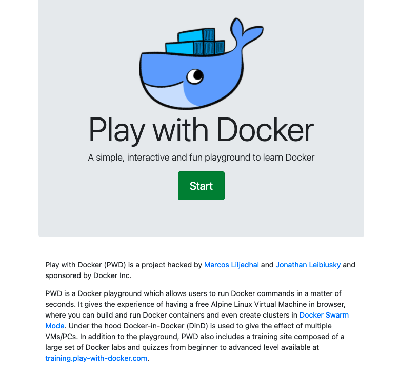
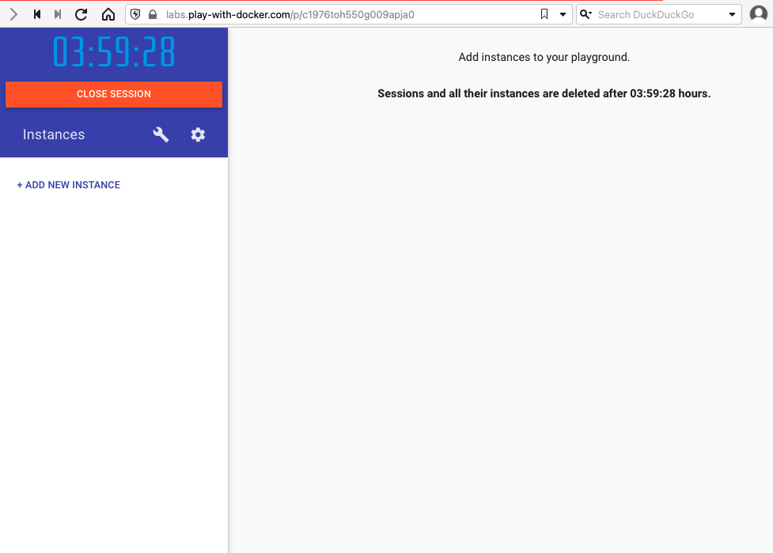
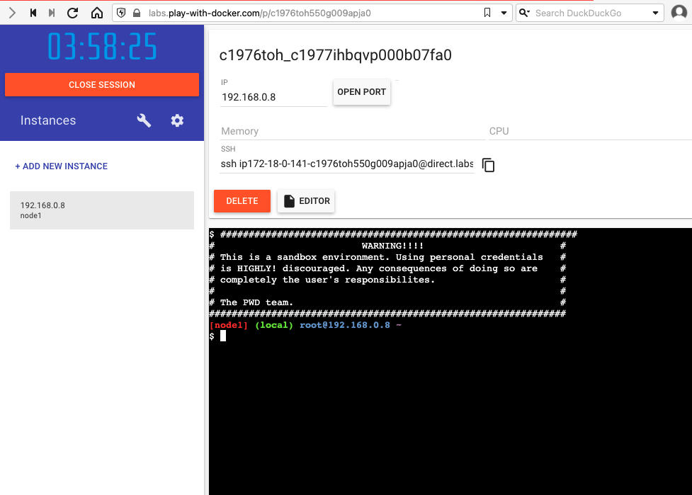

# Docker 101

1. Go to [https://labs.play-with-docker.com](https://labs.play-with-docker.com)
1. Login



1. Click `Start`,



1. Click `ADD NEW INSTANCE`,



```bash
echo 'from flask import Flask

app = Flask(__name__)

@app.route("/")
def hello():
    return "hello world!"

if __name__ == "__main__":
    app.run(host="0.0.0.0")' > app.py
```

Create a Dockerfile,

```bash
echo 'FROM python:3.8-alpine
RUN pip install flask
CMD ["python","app.py"]
COPY app.py /app.py' > Dockerfile
```

Build,

```bash
docker image build -t python-hello-world .
docker image ls
docker run -d --name py-hi -p 5001:5000 python-hello-world
curl http://localhost:5001/
docker ps -a
docker stop py-hi
docker ps -a
export DOCKERHUB_USERNAME=<dockerhub-username>
docker login docker.io -u $DOCKERHUB_USERNAME
docker tag python-hello-world $DOCKERHUB_USERNAME/python-hello-world:1.0.0
docker push $DOCKERHUB_USERNAME/python-hello-world:1.0.0
docker system prune -a
docker image ls
```

If running out of space, start a new session,

```bash
export DOCKERHUB_USERNAME=<dockerhub-username>
docker run -d --name py-hi-2 -p 5002:5000 $DOCKERHUB_USERNAME/python-hello-world:1.0.0
curl http://localhost:5002/
```
