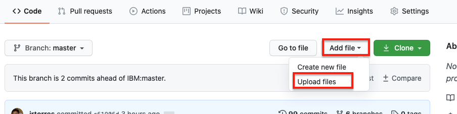
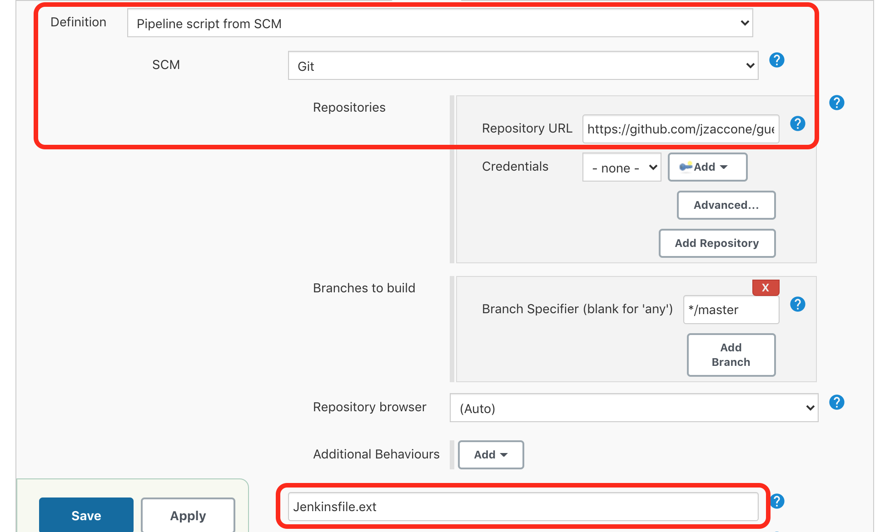
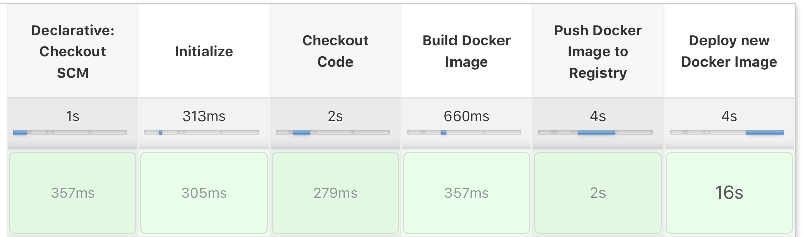
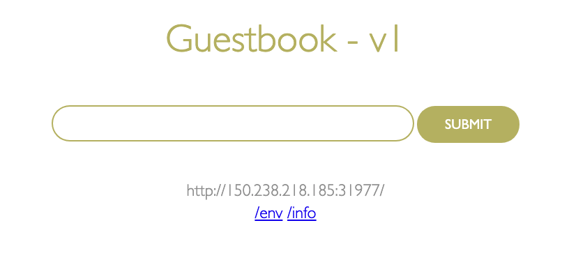
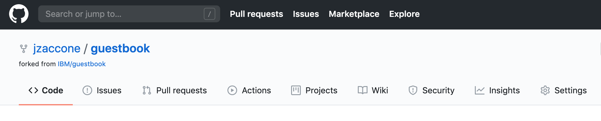
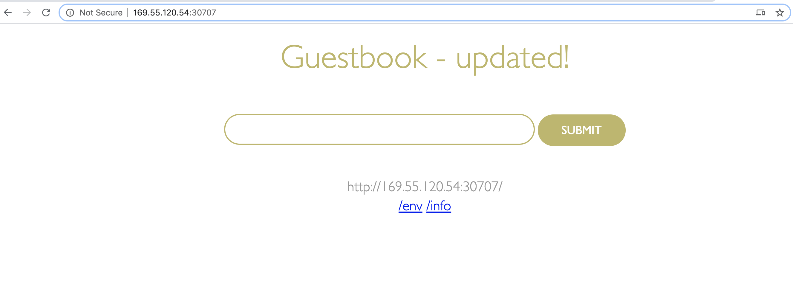

# Creating a CI/CD Pipeline for deployment to IBM Cloud Kubernetes Service using Jenkins

## Overview

In this lab you will be enabling CI/CD connecting your Git repository with the guestbook app to a Continuous Integration/Continuous Deployment pipeline built with Jenkins that will deploy to a IBM Cloud Kubernetes Service cluster.

  > *Note: You will need to [create a GitHub account](https://github.com/join) if you don't have one already.*

## Setup

If you haven't already, set up the `guestbook` application that will be deployed:

1. Open a new browser window or tab and go to the [guestbook application repository](https://github.com/IBM/guestbook)

1. Click on the Fork icon.

   > *Note: you need to fork the repo to have full access to turn of Git WebHooks feature for the repo in later section.*

1. If you have Git installed on your machine, go ahead and clone your fork of the guestbook application, then `cd` into that directory. From a terminal window, execute the following commands (replace the url with your forked repo url):

   ```bash
   git clone https://github.com/[git username]/guestbook
   cd guestbook
   ```

## Lab Steps

We will now configure the CI/CD pipeline with Jenkins to automate application deployment to a IBM Kubernetes cluster.

### Step 0: Create and collect: API Key, Registry Namespace and Cluster Name

We will need all these values when we configure our Jenkins pipeline later.

1. Login to the [IBM Cloud console](https://cloud.ibm.com/). Make sure you have the right account selected in the dropdown (the one with your Kubernetes cluster which you want to deploy to) and open the cloud shell by clicking the icon on the top right of the screen.

   

1. Create an API key using the following command (replace `[key name]` with a name of your choosing). Save the key value by **Copy and Pasting** it to a text editor, we will use it later in our Jenkins Pipeline.

   ```shell
   ibmcloud iam api-key-create [key name]
   ```

1. Create or access a container registry namespace.

   * First, see if you have access to an existing namespace already.

      ```shell
      ibmcloud cr namespace-list
      ```

   * If you get a value above, copy and paste to a text editor for later. If you have no namespaces created, run the following command to create one (replace `[namespace name]` with a name of your choosing).

      ```shell
      ibmcloud cr namespace-add [namespace name]
      ```

1. Access and save the name of your Kubernetes Cluster on IBM Cloud.

   ```shell
   ibmcloud ks clusters
   ```

1. Save the cluster name to a variable by using the following command (replace `[cluster name]` with your cluster name from above step):

   ```shell
   export CLUSTER_NAME=[cluster name]
   ```

### Step 1: Add Jenkinsfile to the Guestbook App

1. We will add a JenkinsFile to your guestbook repository. Download this [JenkinsFile](Jenkinsfile.ext) to your machine. Inspect the [JenkinsFile](Jenkinsfile.ext) to learn what stages we will setup in the next steps.
For your convenience, here is a curl command you can use to download the file.

   ```bash
   curl https://raw.githubusercontent.com/IBMAppModernization/app-modernization-cicd-lab-iks/guestbook-app/Jenkinsfile.ext > Jenkinsfile.ext
   ```

1. To add the file your guestbook repo, you can either (option 1) use the git CLI if you have it installed or (option 2) do it from the browser.

1. (Option 1) Save/move the Jenkinsfile to the root of your guestbook project (where you cloned it).

   * Configure git client (if needed):

      ```bash
      git config --global user.email "[your email]"
      git config --global user.name "[your first and last name]"
      ```

   * Add the Jenkinsfile and commit the changes:

      ```bash
      git add .
      git commit -m "adding jenkinsfile"
      ```

   * Push the changes to your repo:

      ```bash
      git push
      ```

1. (Option 2) Upload the file and commit using a web browser.

   * From your fork of the github repo, click on `Add file`, then `Upload files`.

      

   * Choose the Jenkinsfile.ext you download earlier and click the `Commit changes` button.

### Step 2: Set up the CI/CD pipeline

In this section we will be connecting your forked Git repo of [this app](https://github.com/IBM/guestbook) to set up a Continuous Integration/Continuous Deployment pipeline built with Jenkins. This pipeline contains 3 main steps as follows:

  | Stage                         | Purpose                                                                        |
  | ----------------------------- | ------------------------------------------------------------------------------ |
  | Build Docker Image            | Builds the Docker image based on the Dockerfile                                |
  | Push Docker Image to Registry | Uploads the Docker image to the Docker image registry within ICP               |
  | Deploy New Docker Image       | Updates the image tag in the Kubernetes deployment triggering a rolling update |

More details of this pipeline can be found in the [Jenkinsfile.ext](Jenkinsfile.ext).

1. Log into Jenkins using the URL provided to you by your instructor with the credentials provided to you.

1. The pipeline should have already been created for you.

   

1. Click on your pipeline to open it and then click on the **`Configure`** link in the navigation area at the left to change it's properties.

1. Scroll down to the **`This project is parameterized`** section, here you will have to set some values to connect this pipeline to your cluster.

   * Set the value of **`API_KEY`** to the API_KEY you created and saved earlier for your ibmcloud account. We will be using this key to give Jenkins access to deploy to your cluster and to push images to your container registry. To update the value, click on the 'Change Password' button next to the field and paste your API key.

   * Set the value of the **`CLUSTER_NAME`** to the name of your Kubernetes cluster you want to deploy to.

   * Set the value of the **`REGISTRY_NS`** to the name of your container registry namespace you viewed (or created) earlier. We will deploy our application image to this location.

   * Update **`REGION`** to match the location of your Kubernetes cluster. You can view the location by running `ibmcloud ks clusters`.

1. Scroll down to the **`Build Trigger`** section and select **`GitHub hook trigger for GIT SCM polling`**.

   

1. Scroll down to the **Pipeline** section and find the **Definition** drop down menu. Select **Pipeline script from SCM** and for **SCM** select **Git**.

1. For **Repository URL** enter the url to the cloned repository that you forked earlier (i.e. `https://github.com/[your username]/guestbook.git`)

1. Change the **Script Path** to `Jenkinsfile.ext`.

   

1. Click **Save**.

### Step 3: Manually trigger a build to test pipeline

1. In Jenkins in the navigation area on the left click on **`Build with Parameters`**. Accept the defaults of the parameters and click on **`Build`**

1. To see the console output, click on the build number in the **Build History** and then click on **Console Output**

   

1. If the build is successful the end of the console output should look like the following:

   

1. The Stage View of the pipeline should look like the following:

   

1. When the pipeline is finish deploying, launch the app to verify the it has been deployed and is running. Run the following command to get the port number of your deployed app:

   ```shell
   kubectl --namespace default get service guestbook -o jsonpath='{.spec.ports[0].nodePort}'
   ```

1. Run the following command to get the external IP address of the first worker node in your cluster:

   ```bash
   ibmcloud ks workers --cluster $CLUSTER_NAME | grep -v '^*' | egrep -v "(ID|OK)" | awk '{print $2;}' | head -n1
   ```

1. Your app's URL is the IP address of the first worker node with the port number of the deployed app. For example if your external IP is 169.61.73.182 and the port is 30961 the URL will be ```http://169.61.73.182:30961```

1. Enter the URL in your browser's address bar and verify that the application loads.

   

### Step 4: Trigger a build via a commit to Github

Now you'll configure Github to trigger your pipeline whenever code is committed.

1. Go back to Github and find your cloned repository

1. Click on the repository settings

   

1. Under **`Options`** select **`Webhooks`** and click **`Add webhook`**

   

1. For the Payload URL use `<Jenkins URL>/github-webhook/`  where `<Jenkins URL>` is the URL you used to login to Jenkins (**Note** Don't forget the trailing `/`)

1. Change content type to **application/json**

1. Accept the other defaults and click **`Add webhook`**

   

1. In the Github file browser drill down to */v1/guestbook/public/index.html*

1. Click on the pencil icon to edit **index.html**  and on line 12 locate the header of the page

1. Change  `Guestbook - v1` to `Guestbook - updated!`... or whatever you want!

1. At the bottom of the UI window add a commit message and click on **Commit changes**

1. Switch back to Jenkins and open the pipeline that you were working on  earlier.

1. Verify that your pipeline starts building.

1. When the pipeline is finish deploying, force-refresh (`⌘ + shift + R` on mac) the browser window where you previously loaded the app to verify the change you made.

   > *Note: If you closed the browser window, follow steps 5 - 9 of the previous section to get the URL of the application again.*

   

## Summary

You created a Jenkins pipeline to automatically build and deploy an app that has been updated in Github.
